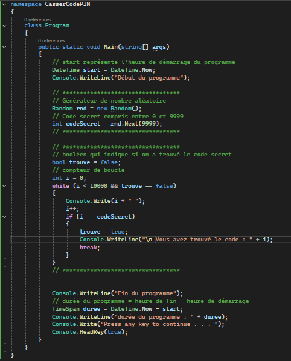
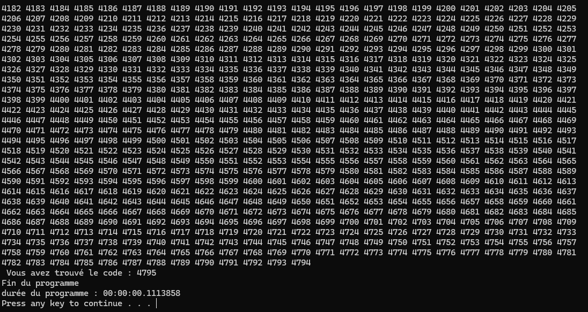

# Réponse MD
## Répondre aux questions suivantes : 
- Que fait le programme dans cet état? 
**Le Programme va chronométrer la durée du programme**
- Quelle est la durée de ce programme en secondes ? 
**Étant donné qu'il n'y a rien dans le programme la durée du programme est d'environ 0,14 seconde**
- En millisecondes (ms)  
**Ce qui donne en milliseconde environ 14 milliseconde**

- Résultat (fournissez une impression ecran)  
**Avec ce code :**

**Cela donne ceci :**

- Quelle est la durée du programme en secondes ? 
**Sur la capture on peut voir que le programme a durée environ 0,11 secondes**

- Relancez le programme. Quelle est sa durée ?
**En considérant la temporisation de 5 millisecondes la durée du programme serait d'environ 1.20 minute**
- Mettez maintenant une temporisation de 1 seconde (= 1 000 ms).
**Cela mettrait environ 10000 seconde a trouvé c'est-à-dire 2h46**
- Lancez le programme : quel est l’effet sur l’attaquant ?
**C'est que cela sera moins detecter mais ça prendre plus de temps**
